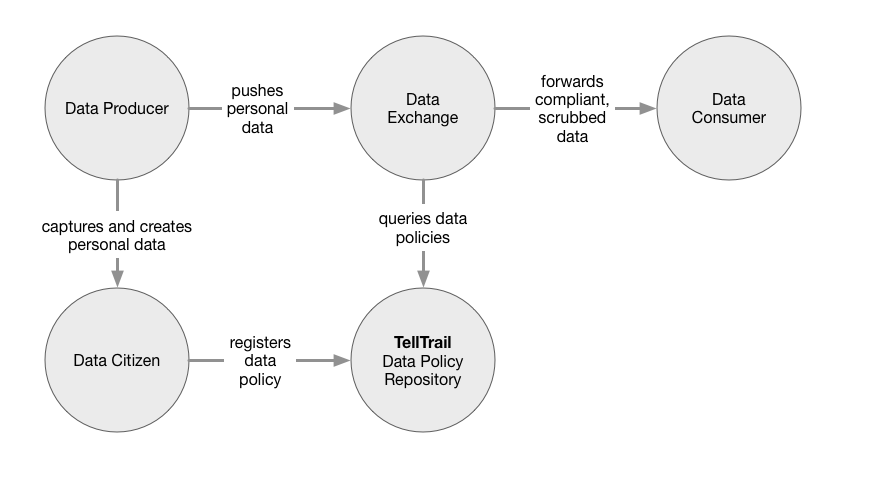

# A Proposal for Personal Data Control

## The Problem With Personal Data

As you move through the modern world, you create personal data about yourself constantly. The things you buy, the articles you read online, the ads you click on: all of these are compiled into behavioral profiles about you that can then be licensed or sold to third parties.

The way personal data is collected and sold is of increasing concern to the public. Once collected, this data is sold and licensed to third parties who typically leverage it to target marketing messages to consumers.

Generally it has been impossible for an average consumer to track or understand how data about them is used, and by whom. As a result itʼs easy to imagine the worst in personal data usage by companies, and this has resulted in a number of responses to control the use of personal data.

## TellTrail: Data Citizens and their Data Policies

People, about whom personal and behavioral data is collected, are not just product. They are data citizens: members of our society that stand as stakeholders in the data that pertains to them. While they are not necessarily the only vote in the usage of that data, nor are they usually the owners of it (observed behavioral data is typically the property of the observer, not the observed), they should have a say in how that data is used.

The central idea is to empower data citizens with the means to define a policy about how their data is used. Different people will have different concerns about data usage, and the policy allows them to express it. A data policy could be coarse-grained or fine- grained, as desired by the citizen, and could incorporate concepts as the type of data (clothing purchases vs articles read, for example) and the identity or nature of the organizations that use it.

We call this approach **TellTrail**.

### Data Policies

TellTrail would first consist of a data policy registry: a website where people could express how data about them should be used. The registry would support graduated complexity: it would start at a sensible and simple default, and then allow as much fine- grained customization as the data citizen felt like using.

### Citizen Control of Data

A data citizen would be able to exert several forms of control over their personal data, within their data policy:

* A general default policy that applies if no more specific policies apply.
* Policies based on the letter grade of the data user.
* Policies based on the category of personal data in question (for example: articlesread, specific categories of e-commerce, social networking data etc.)
* Policies for specific data users: “whitelists” and “blacklists”.

### TellTrail Badge

TellTrail compliant data producers and data users would indicate their adherence to TellTrail data policies by displaying a badge containing the TellTrail certification mark (like TRUSTe or Fair Trade Coffee). The presence of this mark would indicate to a visitor that the organization agrees to follow the data policies set forth by the data citizen.

### Letter Grades

Because the needs of organizations vary, there would be a simple letter grade system to indicate the level of compliance from a data producer or data user organization:

* **C**: Indicates an organizationʼs willingness to follow the policies of data citizens for all data that it acquires from external sources. It will not necessarily follow those policies for data it creates itself.
* **B**: The organization will apply data policies to both externally sourced and internally created data.
* **A**: Same as the “B” level, but with external verification of compliance.

Letter grades for data producers/users are one of the criteria by which data citizens can control their data usage.

### Data Exchanges

Finally, to facilitate data policy compliant transfers of personal data, data exchanges can implement licensed transfer of personal data from data producers to data users, scrubbing data as required by the data policies.

### How Data Policies Work

**Personal data** is created by **data producers**, either through their observation of, or disclosure from the **data citizen**. The data citizen registers their data policy with the **data policy repository** (TellTrail.me).

To monetize the personal data theyʼve created, the data producer pushes it to a **data exchange**, which in turn queries the data policy repository for policies relevant to the personal data it has received. Finally the exchange scrubs the personal data to make it compliant with the data policies, before forwarding the scrubbed, compliant data set to the **data consumer**.